# Mybatis

Mybatis 和 SpringMVC 通过订单商品案例驱动

官方中文地址：http://www.mybatis.org/mybatis-3/zh/

官方托管地址：https://github.com/mybatis/mybatis-3

# 基础知识：

## 对原生态 jdbc 程序（单独使用 jdbc 开发）问题总结

### 1、环境

​		java 环境 ：jdk1.8.0_77

​		开发工具 ： IDEA 2016.1

​		数据库 ： MySQL 5.7

### 2、创建数据库

​		mybatis_test.sql

​		Tables ：items、orderdetail、orders、user

### 3、JDBC 程序

​		使用 JDBC 查询 MySQL 数据库中用户表的记录

​		代码：

```java
package cn.zhisheng.mybatis.jdbc;

/**
 * Created by 10412 on 2016/11/27.
 */

import java.sql.*;

/**
 *通过单独的jdbc程序来总结问题
 */

public class JdbcTest
{
    public static void main(String[] args)
    {
        //数据库连接
        Connection connection = null;
        //预编译的Statement，使用预编译的Statement可以提高数据库性能
        PreparedStatement preparedStatement = null;
        //结果集
        ResultSet resultSet = null;

        try
        {
            //加载数据库驱动
            Class.forName("com.mysql.jdbc.Driver");

            //通过驱动管理类获取数据库链接
            connection =  DriverManager.getConnection("jdbc:mysql://localhost:3306/mybatis_test?characterEncoding=utf-8", "root", "root");
            //定义sql语句 ?表示占位符（在这里表示username）
            String sql = "select * from user where username = ?";
            //获取预处理statement
            preparedStatement = connection.prepareStatement(sql);
            //设置参数，第一个参数为sql语句中参数的序号（从1开始），第二个参数为设置的参数值
            preparedStatement.setString(1, "王五");
            //向数据库发出sql执行查询，查询出结果集
            resultSet =  preparedStatement.executeQuery();
            //遍历查询结果集
            while(resultSet.next())
            {
                System.out.println(resultSet.getString("id")+"  "+resultSet.getString("username"));
            }
        } catch (Exception e) {
            e.printStackTrace();
        }finally{
            //释放资源
            if(resultSet!=null)
            {
                try {
                    resultSet.close();
                } catch (SQLException e) {
                    // TODO Auto-generated catch block
                    e.printStackTrace();
                }
            }
            if(preparedStatement!=null)
            {
                try {
                    preparedStatement.close();
                } catch (SQLException e) {
                    // TODO Auto-generated catch block
                    e.printStackTrace();
                }
            }
            if(connection!=null)
            {
                try {
                    connection.close();
                } catch (SQLException e) {
                    // TODO Auto-generated catch block
                    e.printStackTrace();
                }
            }

        }

    }

}

```


### 4、问题总结

> + 数据库连接，使用时就创建，不使用立即释放，对数据库频繁连接开启和关闭，造成数据库资源的浪费，影响数据库性能。
>
>   解决方法：使用数据库连接池管理数据库连接。
>
> + 将 sql 语句**硬编码**到 java 代码中，如果 sql 语句需要修改，那么就需要重新编译 java 代码，不利于系统的维护。
>
>   设想：将 sql 语句配置在 xml 配置文件中，即使 sql 语句发生变化，也不需要重新编译 java 代码。
>
> + 向 preparedStatement 中设置参数，对占位符号位置和设置参数值，硬编码在 java 代码中，同样也不利于系统的维护。
>
>   设想：将 sql 语句、占位符、参数值配置在 xml 配置文件中。
>
> + 从 resultSet 中遍历结果集数据时，存在硬编码，将获取表的字段进行硬编码，不利于系统维护。
>
>   设想：将查询的结果集自动映射成 java 对象。


## Mybatis框架原理（掌握）

### 1、Mybatis 是什么？

​	Mybatis 是一个持久层的架构，是 appach 下的顶级项目。

​	Mybatis 原先是托管在 googlecode 下，再后来是托管在 Github 上。

​	Mybatis 让程序员将主要的精力放在 sql 上，通过 Mybatis 提供的映射方式，自由灵活生成（半自动，大部分需要程序员编写 sql ）满足需要 sql 语句。

​	Mybatis 可以将向 preparedStatement 中的输入参数自动进行**输入映射**，将查询结果集灵活的映射成 java 对象。（**输出映射**）

### 2、Mybatis 框架

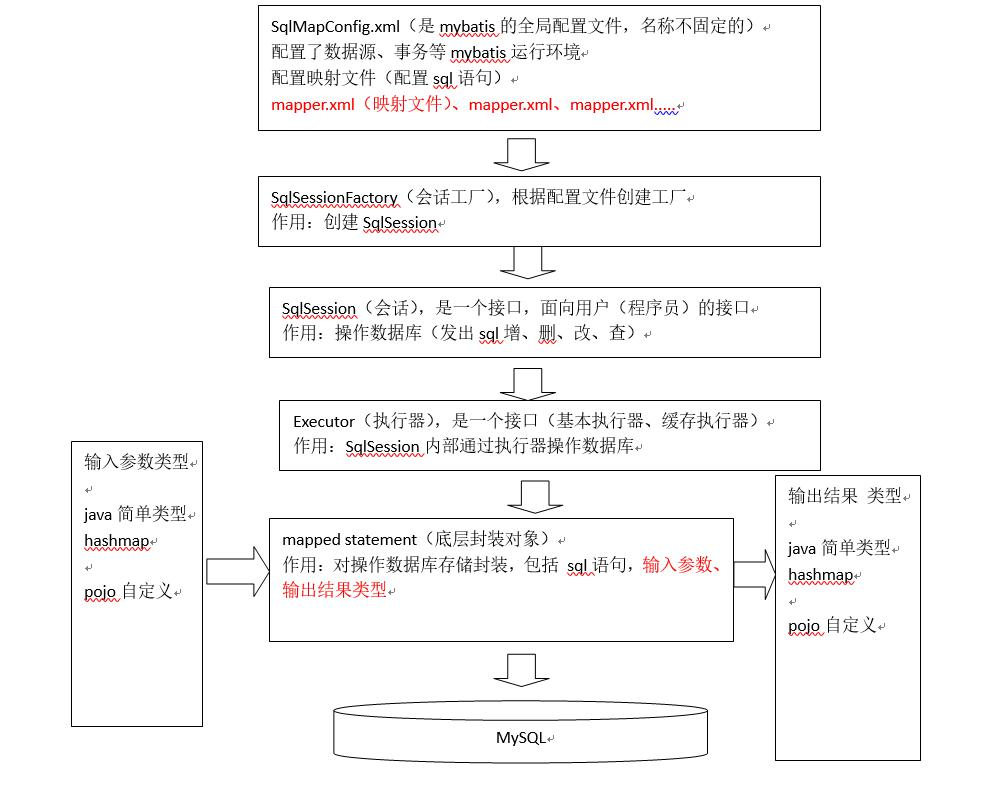

注解：

> + SqlMapConfig.xml （Mybatis的全局配置文件，名称不定）配置了数据源、事务等 Mybatis 运行环境
>
> + Mapper.xml 映射文件（配置 sql 语句）
>
> + SqlSessionFactory （会话工厂）根据配置文件配置工厂、创建 SqlSession
>
> + SqlSession （会话）面向用户的接口、操作数据库（发出 sql 增删改查）
>
> + Executor （执行器）是一个接口（基本执行器、缓存执行器）、SqlSession 内部通过执行器操作数据库
>
> + Mapped Statement （底层封装对象）对操作数据库存储封装，包括 sql 语句、输入参数、输出结果类型
>    ​


## Mybatis入门程序

### 1、需求

实现以下功能：

> + 根据用户id查询一个用户信息
> + 根据用户名称模糊查询用户信息列表
> + 添加用户
> + 更新用户
> + 删除用户

### 2、环境

java 环境 ：jdk1.8.0_77

开发工具 ： IDEA 2016.1

数据库 ： MySQL 5.7

Mybatis 运行环境（ jar 包）

MySQL 驱动包

其他依赖包

### 3、 log4j.properties

在classpath下创建log4j.properties如下：

```properties
# Global logging configuration
#在开发环境日志级别要设置为DEBUG、生产环境要设置为INFO或者ERROR
log4j.rootLogger=DEBUG, stdout
# Console output...
log4j.appender.stdout=org.apache.log4j.ConsoleAppender
log4j.appender.stdout.layout=org.apache.log4j.PatternLayout
log4j.appender.stdout.layout.ConversionPattern=%5p [%t] - %m%n

```

Mybatis默认使用log4j作为输出日志信息。


### 4、工程结构

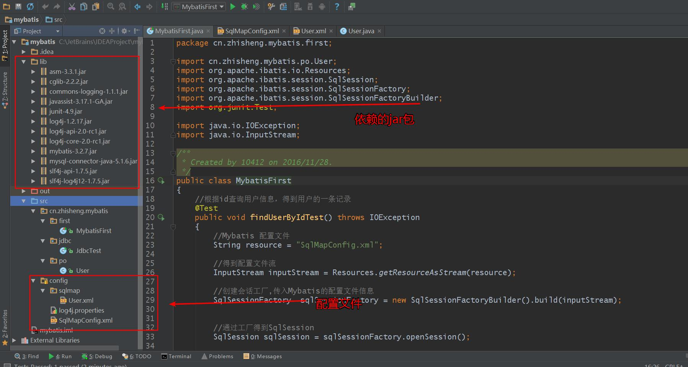


### 5、SqlMapConfig.xml

配置 Mybatis 的运行环境、数据源、事务等

```xml
<?xml version="1.0" encoding="UTF-8" ?>
<!DOCTYPE configuration
        PUBLIC "-//mybatis.org//DTD Config 3.0//EN"
        "http://mybatis.org/dtd/mybatis-3-config.dtd">
<configuration>
    <!-- 和spring整合后 environments配置将废除-->
    <environments default="development">
        <environment id="development">
            <!-- 使用jdbc事务管理,事务由 Mybatis 控制-->
            <transactionManager type="JDBC" />
            <!-- 数据库连接池,由Mybatis管理，数据库名是mybatis_test，Mysql用户名root，密码root -->
            <dataSource type="POOLED">
                <property name="driver" value="com.mysql.jdbc.Driver" />
                <property name="url" value="jdbc:mysql://localhost:3306/mybatis_test?characterEncoding=utf-8" />
                <property name="username" value="root" />
                <property name="password" value="root" />
            </dataSource>
        </environment>
    </environments>
</configuration>
```


### 6、创建 po 类

Po 类作为 mybatis 进行 sql 映射使用，po 类通常与数据库表对应，User.java 如下：

```java
package cn.zhisheng.mybatis.po;

import java.util.Date;

/**
 * Created by 10412 on 2016/11/28.
 */
public class User
{
    private int id;
    private String username;            // 用户姓名
    private String sex;                 // 性别
    private Date birthday;              // 生日
    private String address;             // 地址

    //getter and setter

    public int getId() {
        return id;
    }

    public void setId(int id) {
        this.id = id;
    }

    public String getUsername() {
        return username;
    }

    public void setUsername(String username) {
        this.username = username;
    }

    public Date getBirthday() {
        return birthday;
    }

    public void setBirthday(Date birthday) {
        this.birthday = birthday;
    }

    public String getSex() {
        return sex;
    }

    public void setSex(String sex) {
        this.sex = sex;
    }

    public String getAddress() {
        return address;
    }

    public void setAddress(String address) {
        this.address = address;
    }
}
```


### 7、根据用户 id（主键）查询用户信息

+  映射文件

   > + User.xml（原在 Ibatis 中命名）在 Mybatis 中命名规则为 xxxmapper.xml
   > + 在映射文件中配置 sql 语句

   `User.xml`

   ```xml
   <?xml version="1.0" encoding="UTF-8" ?>
   <!DOCTYPE mapper
   PUBLIC "-//mybatis.org//DTD Mapper 3.0//EN"
   "http://mybatis.org/dtd/mybatis-3-mapper.dtd">
   <mapper namespace="test">
   </mapper>
   ```

   `namespace` ：命名空间，对 sql 进行分类化管理，用于隔离 sql 语句，后面会讲另一层非常重要的作用。

   ​

   在 `User.xml` 中加入

   ```xml
   <!--通过select执行数据库查询
           id:标识映射文件中的sql
           将sql语句封装到mappedStatement对象中，所以id称为Statement的id
           #{}：表示占位符
           #{id}：其中的id表示接收输入的参数，参数名称就是id，如果输入参数是简单类型，那么#{}中的参数名可以任意，可以是value或者其他名称
           parameterType：表示指定输入参数的类型
           resultType：表示指定sql输出结果的所映射的java对象类型
    -->
   <!-- 根据id获取用户信息 -->
       <select id="findUserById" parameterType="int" resultType="cn.zhisheng.mybatis.po.User">
           select * from user where id = #{id}
       </select>
   ```

   `User.xml` 映射文件已经完全写好了，那接下来就需要在 `SqlMapConfig.xml`中加载映射文件 `User.xml`

   ```xml
   <!--加载映射文件-->
       <mappers>
           <mapper resource="sqlmap/User.xml"/>
       </mappers>
   ```

   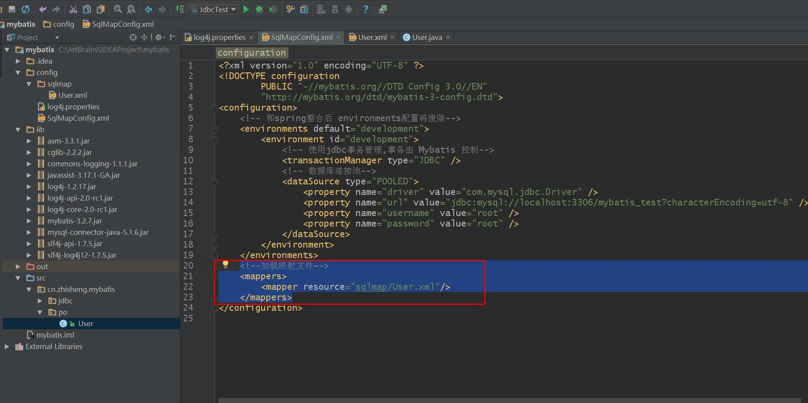

   ​

+  编写程序

           `MybatisFirst.java`

           ​


```java
   package cn.zhisheng.mybatis.first;

   import cn.zhisheng.mybatis.po.User;
   import org.apache.ibatis.io.Resources;
   import org.apache.ibatis.session.SqlSession;
   import org.apache.ibatis.session.SqlSessionFactory;
   import org.apache.ibatis.session.SqlSessionFactoryBuilder;
   import org.junit.Test;

   import java.io.IOException;
   import java.io.InputStream;

       /**
   * Created by 10412 on 2016/11/28.
   */
   public class MybatisFirst
   {
      //根据id查询用户信息，得到用户的一条记录
      @Test
      public void findUserByIdTest() throws IOException
      {
          //Mybatis 配置文件
          String resource = "SqlMapConfig.xml";

          //得到配置文件流
          InputStream inputStream = Resources.getResourceAsStream(resource);

          //创建会话工厂,传入Mybatis的配置文件信息
          SqlSessionFactory  sqlSessionFactory = new SqlSessionFactoryBuilder().build(inputStream);

        //通过工厂得到SqlSession
         SqlSession sqlSession = sqlSessionFactory.openSession();

         //通过SqlSession操作数据库
         //第一个参数：映射文件中Statement的id，等于 = namespace + "." + Statement的id
         //第二个参数：指定和映射文件中所匹配的parameterType类型的参数
         //sqlSession.selectOne 结果与映射文件中所匹配的resultType类型的对象
         User user = sqlSession.selectOne("test.findUserById", 1);

         System.out.println(user);

         //释放资源
         sqlSession.close();
     }
   }
```


然后运行一下这个测试，发现结果如下就代表可以了：

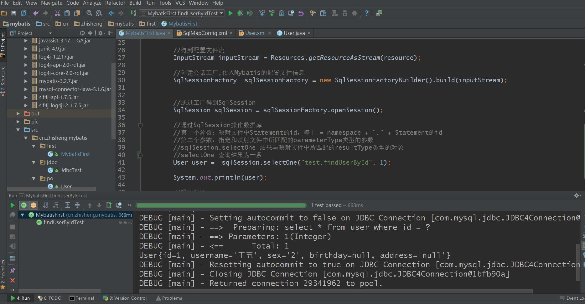


### 8、根据用户名称模糊查询用户信息列表

+ 映射文件

  依旧使用 User.xml 文件，只不过要在原来的文件中加入

  ```xml
  <!-- 自定义条件查询用户列表
  	resultType：指定就是单条记录所映射的java对象类型
      ${}:表示拼接sql串，将接收到的参数内容不加修饰的拼接在sql中
      使用${}拼接sql，会引起sql注入
      ${value}：接收输入参数的内容，如果传入类型是简单类型，${}中只能够使用value 
  -->
      <select id="findUserByUsername" parameterType="java.lang.String" resultType="cn.zhisheng.mybatis.po.User">
          select * from user where username like '%${value}%'
      </select>
  ```

  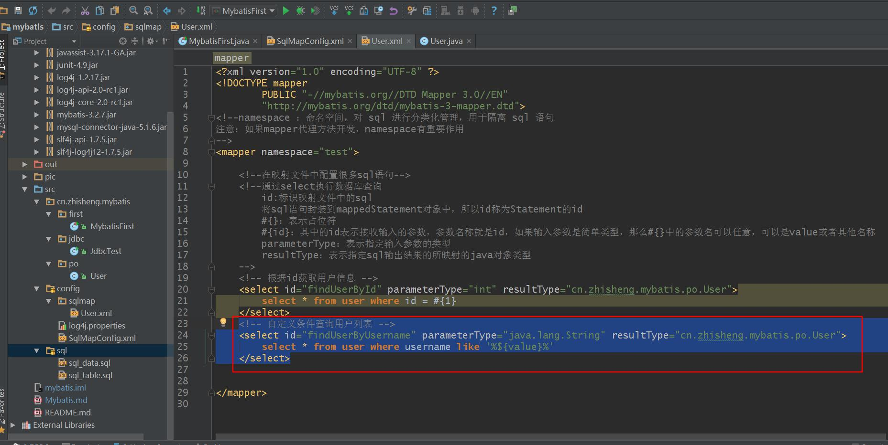


+ 编写程序

  依旧直接在刚才那个 `MybatisFirst.java` 中加入测试代码：

  ```java
  //根据用户名称模糊查询用户信息列表
      @Test
      public void findUserByUsernameTest() throws IOException
      {
          //Mybatis 配置文件
          String resource = "SqlMapConfig.xml";

          //得到配置文件流
          InputStream inputStream = Resources.getResourceAsStream(resource);

          //创建会话工厂,传入Mybatis的配置文件信息
          SqlSessionFactory  sqlSessionFactory = new SqlSessionFactoryBuilder().build(inputStream);
        //通过工厂得到SqlSession
        SqlSession sqlSession = sqlSessionFactory.openSession();

        //通过SqlSession操作数据库
        //第一个参数：映射文件中Statement的id，等于 = namespace + "." + Statement的id
        //第二个参数：指定和映射文件中所匹配的parameterType类型的参数

        //selectList 查询结果可能多条
        //list中的user和映射文件中resultType所指定的类型一致
        List<User> list = sqlSession.selectList("test.findUserByUsername", "小明");

        System.out.println(list);

        //释放资源
        sqlSession.close();
    }
  ```


同样测试一下`findUserByUsernameTest` ，如果运行结果如下就代表没问题：

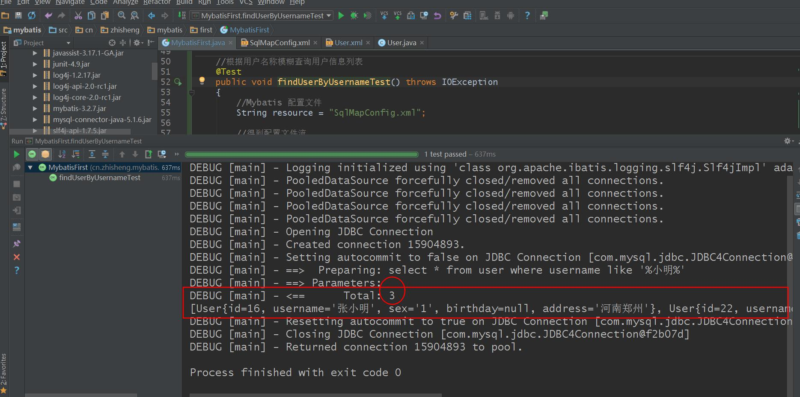


### 提示：

通过这个代码可以发现，其中有一部分代码是冗余的，我们可以将其封装成一个函数。

```java
public void createSqlSessionFactory() throws IOException {
		// 配置文件
		String resource = "SqlMapConfig.xml";
		InputStream inputStream = Resources.getResourceAsStream(resource);
		// 使用SqlSessionFactoryBuilder从xml配置文件中创建SqlSessionFactory
		sqlSessionFactory = new SqlSessionFactoryBuilder().build(inputStream);
	}
```


## 注意：

### 1、#{ } 和 ${ } 的区别

> + `#{ }`表示一个占位符号，通过`#{ }`可以实现 `preparedStatement` 向占位符中设置值，自动进行java 类型和 jdbc 类型转换，`#{ }` 可以有效防止sql注入。`#{ }` 可以接收简单类型值或 pojo 属性值（通过 OGNL 读取对象中的值，属性.属性.属性..方式获取对象属性值）。 如果 `parameterType` 传输单个简单类型值，`#{ } `括号中可以是 value 或其它名称。
> + `${ }` 表示拼接 sql 串，通过`${ }`可以将 parameterType 传入的内容拼接在 sql 中且不进行 jdbc 类型转换， `${ }`可以接收简单类型值或 pojo 属性值（（通过 OGNL 读取对象中的值，属性.属性.属性..方式获取对象属性值）），如果 parameterType 传输单个简单类型值，${}括号中只能是 value。

### 2、parameterType 和 resultType 区别 

> + parameterType：指定输入参数类型，mybatis 通过 ognl 从输入对象中获取参数值拼接在 sql 中。
> + resultType：指定输出结果类型，mybatis 将 sql 查询结果的一行记录数据映射为 resultType 指定类型的对象。

### 3、selectOne 和 selectList 区别

> + selectOne 查询一条记录来进行映射，如果使用selectOne查询多条记录则抛出异常：
>
>   org.apache.ibatis.exceptions.TooManyResultsException: Expected one result (or null) to bereturned by selectOne(), but found: 3 at 
>
> + selectList 可以查询一条或多条记录来进行映射。


### 9、添加用户

+ 映射文件

  在 User.xml 中加入：

  ```xml
  <!-- 添加用户 -->
      <insert id="insetrUser" parameterType="cn.zhisheng.mybatis.po.User" > 
         <selectKey keyProperty="id" order="AFTER" resultType="java.lang.Integer">
              select LAST_INSERT_ID()
          </selectKey>
          insert into user(username, birthday, sex, address)
          values(#{username}, #{birthday}, #{sex}, #{address})
      </insert>
  ```

  注意: 

  > + selectKey将主键返回，需要再返回
  > + 添加selectKey实现将主键返回
  > + keyProperty:返回的主键存储在pojo中的哪个属性
  > + order：selectKey的执行顺序，是相对与insert语句来说，由于mysql的自增原理执行完insert语句之后才将主键生成，所以这里selectKey的执行顺序为after
  > + resultType:返回的主键是什么类型
  > + LAST_INSERT_ID():是mysql的函数，返回auto_increment自增列新记录id值。

然后在 `MybatisFirst.java` 中写一个测试函数，代码如下

```java
@Test
    public void insetrUser() throws IOException, ParseException {
        //Mybatis 配置文件
        String resource = "SqlMapConfig.xml";
        //得到配置文件流
        InputStream inputStream = Resources.getResourceAsStream(resource);
        //创建会话工厂,传入Mybatis的配置文件信息
        SqlSessionFactory  sqlSessionFactory = new SqlSessionFactoryBuilder().build(inputStream);
        //通过工厂得到SqlSession
        SqlSession sqlSession = sqlSessionFactory.openSession();
        User user = new User();
        SimpleDateFormat sdf = new SimpleDateFormat ("yyyy-MM-dd");
        user.setUsername("田志声");
        user.setSex("男");
        user.setBirthday(sdf.parse("2016-11-29"));
        user.setAddress("江西南昌");
        sqlSession.insert("test.insetrUser", user);
        sqlSession.commit();
        //释放资源
        sqlSession.close();
    }
```

然后 run 一下，如果出现的结果如下，那么就是成功了。

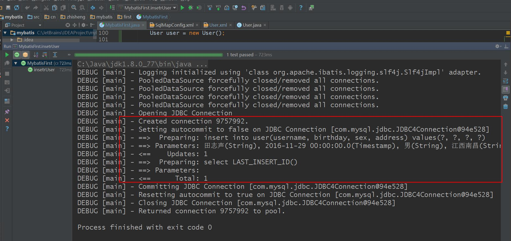

同时数据库也能查询到刚插入的用户信息：

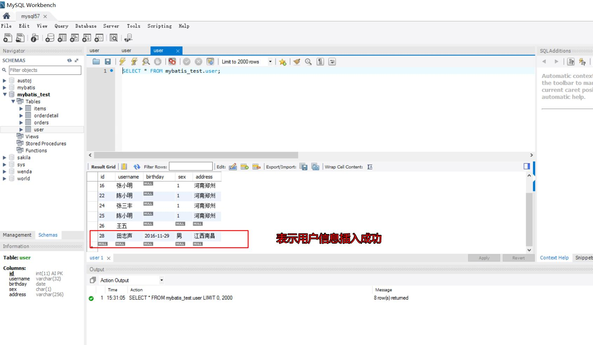


### 10、自增主键返回 与 非自增主键返回

+ MySQL 自增主键：执行 insert 提交之前自动生成一个自增主键，通过 MySQL 函数获取到刚插入记录的自增主键： LAST_INSERT_ID() ，是在 insert 函数之后调用。

+ 非自增主键返回：使用 MySQL 的 uuid() 函数生成主键，需要修改表中 id 字段类型为 String ，长度设置为 35 位，执行思路：先通过 uuid() 查询到主键，将主键输入到 sql 语句中；执行 uuid() 语句顺序相对于 insert 语句之前执行。

  刚才那个插入用户的地方，其实也可以通过 uuid() 来生成主键，如果是这样的话，那么我们就需要在 `User.xml` 中加入如下代码：

  ```xml
  <!--使用 MySQL 的 uuid()生成主键
      执行过程：
      首先通过uuid()得到主键，将主键设置到user对象的id属性中
      其次执行insert时，从user对象中取出id属性值
   -->
  <selectKey keyProperty="id" order="BEFORE" resultType="java.lang.String">
              select uuid()
  </selectKey>
  insert into user(id, username, birthday, sex, address) values(#{id}, #{username}, #{birthday}, #{sex}, #{address})
  ```

+ Oracle 使用序列生成主键

  首先自定义一个序列且用于生成主键，selectKey使用如下：

  ```xml
  <insert  id="insertUser" parameterType="cn.itcast.mybatis.po.User">
    <selectKey resultType="java.lang.Integer" order="BEFORE" 
      keyProperty="id">
      SELECT 自定义序列.NEXTVAL FROM DUAL
    </selectKey>
  insert into user(id,username,birthday,sex,address) 
         values(#{id},#{username},#{birthday},#{sex},#{address})
  </insert>

  ```

  ​

### 11、删除用户

前面说了这么多了，这里就简单来说明下：

在 User.xml 文件中加入如下代码：

```xml
<!--删除用户-->
    <delete id="deleteUserById" parameterType="int">
        delete from user where user.id = #{id}
    </delete>
```

在 MybatisFirst.java 文件中加入如下代码：

```java
//删除用户
    @Test
    public void deleteUserByIdTest() throws IOException
    {
        //Mybatis 配置文件
        String resource = "SqlMapConfig.xml";

        //得到配置文件流
        InputStream inputStream = Resources.getResourceAsStream(resource);

        //创建会话工厂,传入Mybatis的配置文件信息
        SqlSessionFactory  sqlSessionFactory = new SqlSessionFactoryBuilder().build(inputStream);


        //通过工厂得到SqlSession
        SqlSession sqlSession = sqlSessionFactory.openSession();

        //通过SqlSession操作数据库
        //第一个参数：映射文件中Statement的id，等于 = namespace + "." + Statement的id
        //第二个参数：指定和映射文件中所匹配的parameterType类型的参数

        sqlSession.delete("test.deleteUserById", 26);

        //提交事务
        sqlSession.commit();
      
        //释放资源
        sqlSession.close();
    }
```

测试结果如下：

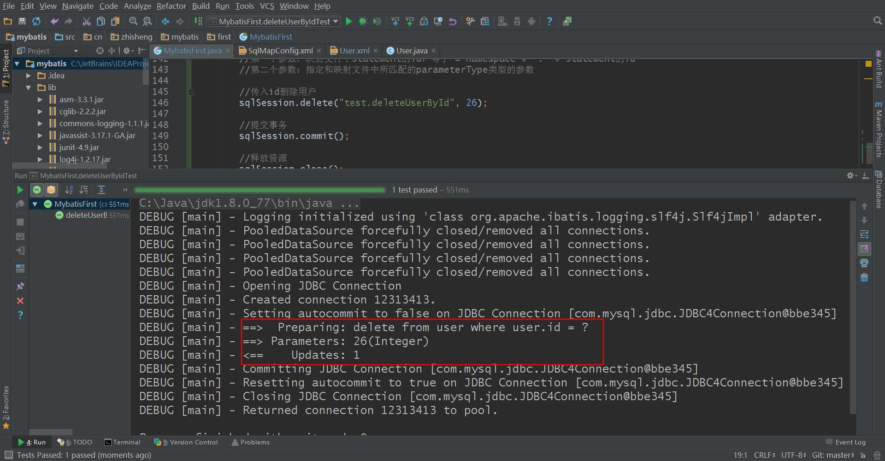

之前的数据库 user 表查询结果：

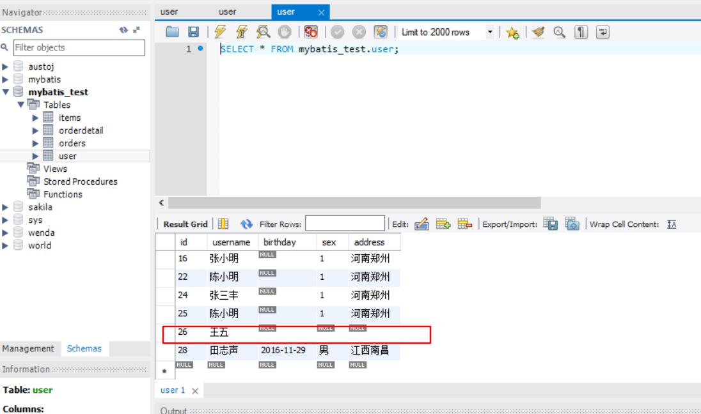

执行完测试代码后，结果如下：

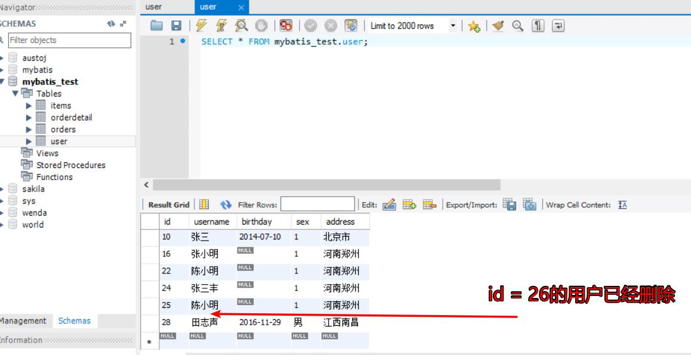


### 12、更新用户信息

在 User.xml 中加入如下代码：

```xml
<!--根据id更新用户
        需要输入用户的id
        传入用户要更新的信息
        parameterType指定user对象，包括id和更新信息，id必须存在
        #{id}：从输入对象中获取id属性值
-->
<update id="updateUserById" parameterType="cn.zhisheng.mybatis.po.User">
        update user set username = #{username}, birthday = #{birthday}, sex = #{sex}, address = #{address} where user.id = #{id}
    </update>
```

然后在 MybatisFirst.java 中加入

```java
//根据id更新用户信息
    @Test
    public void updateUserByIdTest() throws IOException, ParseException {
        //Mybatis 配置文件
        String resource = "SqlMapConfig.xml";

        //得到配置文件流
        InputStream inputStream = Resources.getResourceAsStream(resource);

        //创建会话工厂,传入Mybatis的配置文件信息
        SqlSessionFactory  sqlSessionFactory = new SqlSessionFactoryBuilder().build(inputStream);

        //通过工厂得到SqlSession
        SqlSession sqlSession = sqlSessionFactory.openSession();

        //为了设置生日的日期输入
        SimpleDateFormat sdf = new SimpleDateFormat ("yyyy-MM-dd");

        User user = new User();
        //根据id更新用户信息
        user.setId(24);
        user.setUsername("张四风");
        user.setBirthday(sdf.parse("2015-01-12"));
        user.setSex("女");
        user.setAddress("上海黄埔");

        //通过SqlSession操作数据库
        //第一个参数：映射文件中Statement的id，等于 = namespace + "." + Statement的id
        //第二个参数：指定和映射文件中所匹配的parameterType类型的参数
        sqlSession.update("test.updateUserById", user);

        //提交事务
        sqlSession.commit();

        //释放资源
        sqlSession.close();
    }
```

测试结果如下：

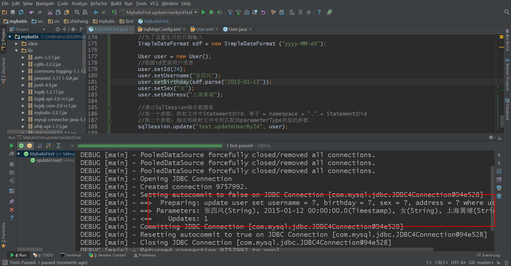

查看数据库，id 为 24 的用户信息是否更新了：

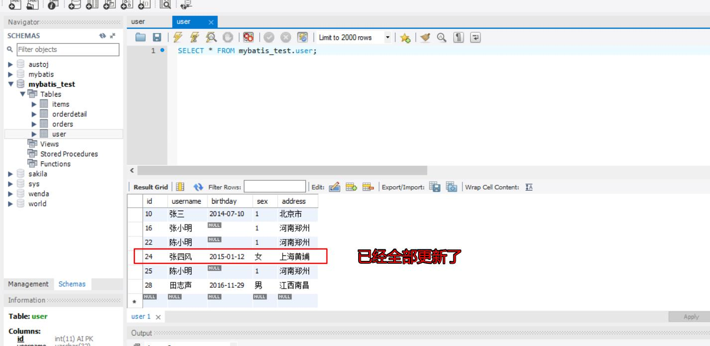 

啊，是不是很爽，所有的需求都完成了。

没错，这只是 Mybatis 的一个简单的入门程序，简单的实现了对数据库的增删改查功能，通过这个我们大概可以了解这个编程方式了。


### Mybatis 解决 jdbc 编程的问题

1、  数据库链接创建、释放频繁造成系统资源浪费从而影响系统性能，如果使用数据库链接池可解决此问题。

解决：在SqlMapConfig.xml中配置数据链接池，使用连接池管理数据库链接。

2、  Sql语句写在代码中造成代码不易维护，实际应用sql变化的可能较大，sql变动需要改变java代码。

解决：将Sql语句配置在XXXXmapper.xml文件中与java代码分离。

3、  向sql语句传参数麻烦，因为sql语句的where条件不一定，可能多也可能少，占位符需要和参数一一对应。

解决：Mybatis自动将java对象映射至sql语句，通过statement中的parameterType定义输入参数的类型。

4、  对结果集解析麻烦，sql变化导致解析代码变化，且解析前需要遍历，如果能将数据库记录封装成pojo对象解析比较方便。

解决：Mybatis自动将sql执行结果映射至java对象，通过statement中的resultType定义输出结果的类型。


### Mybatis 与 Hibernate 不同

Mybatis和hibernate不同，它不完全是一个ORM框架，因为MyBatis需要程序员自己编写Sql语句，不过mybatis可以通过XML或注解方式灵活配置要运行的sql语句，并将java对象和sql语句映射生成最终执行的sql，最后将sql执行的结果再映射生成java对象。

 Mybatis学习门槛低，简单易学，程序员直接编写原生态sql，可严格控制sql执行性能，灵活度高，非常适合对关系数据模型要求不高的软件开发，例如互联网软件、企业运营类软件等，因为这类软件需求变化频繁，一但需求变化要求成果输出迅速。但是灵活的前提是mybatis无法做到数据库无关性，如果需要实现支持多种数据库的软件则需要自定义多套sql映射文件，工作量大。

 Hibernate对象/关系映射能力强，数据库无关性好，对于关系模型要求高的软件（例如需求固定的定制化软件）如果用hibernate开发可以节省很多代码，提高效率。但是Hibernate的学习门槛高，要精通门槛更高，而且怎么设计O/R映射，在性能和对象模型之间如何权衡，以及怎样用好Hibernate需要具有很强的经验和能力才行。

总之，按照用户的需求在有限的资源环境下只要能做出维护性、扩展性良好的软件架构都是好架构，所以框架只有适合才是最好。


## Mybatis 开发 dao 

### 两种方法

+ 原始 dao 开发方法（程序需要编写 dao 接口和 dao 实现类）（掌握）
+ Mybatis 的 mapper 接口（相当于 dao 接口）代理开发方法（掌握）

### 需求

将下边的功能实现Dao：

+ 根据用户id查询一个用户信息
+ 根据用户名称模糊查询用户信息列表
+ 添加用户信息

Mybatis 配置文件 SqlMapConfig.xml

### Sqlsession 的使用范围

SqlSession 中封装了对数据库的操作，如：查询、插入、更新、删除等。

通过 SqlSessionFactory 创建 SqlSession，而 SqlSessionFactory 是通过 SqlSessionFactoryBuilder 进行创建。

### 1、SqlSessionFactoryBuilder

SqlSessionFactoryBuilder 用于创建 SqlSessionFacoty，SqlSessionFacoty 一旦创建完成就不需要SqlSessionFactoryBuilder 了，因为 SqlSession 是通过 SqlSessionFactory 生产，所以可以将SqlSessionFactoryBuilder 当成一个工具类使用，最佳使用范围是方法范围即方法体内局部变量。

### 2、SqlSessionFactory

SqlSessionFactory 是一个接口，接口中定义了 openSession 的不同重载方法，SqlSessionFactory 的最佳使用范围是整个应用运行期间，一旦创建后可以重复使用，通常以单例模式管理 SqlSessionFactory。

### 3、SqlSession

SqlSession 是一个面向用户的接口， sqlSession 中定义了数据库操作，默认使用 DefaultSqlSession 实现类。

执行过程如下：

1）、  加载数据源等配置信息

Environment environment = configuration.getEnvironment();

2）、  创建数据库链接

3）、  创建事务对象

4）、  创建Executor，SqlSession 所有操作都是通过 Executor 完成，mybatis 源码如下：

```java
if (ExecutorType.BATCH == executorType) {
      executor = newBatchExecutor(this, transaction);
    } elseif (ExecutorType.REUSE == executorType) {
      executor = new ReuseExecutor(this, transaction);
    } else {
      executor = new SimpleExecutor(this, transaction);
    }
if (cacheEnabled) {
      executor = new CachingExecutor(executor, autoCommit);
    }
```

5）、  SqlSession的实现类即 DefaultSqlSession，此对象中对操作数据库实质上用的是 Executor

### 结论：

         每个线程都应该有它自己的SqlSession实例。SqlSession的实例不能共享使用，它也是线程不安全的。因此最佳的范围是请求或方法范围(定义局部变量使用)。绝对不能将SqlSession实例的引用放在一个类的静态字段或实例字段中。

         打开一个SqlSession；使用完毕就要关闭它。通常把这个关闭操作放到 finally 块中以确保每次都能执行关闭。如下：

```jade
SqlSession session = sqlSessionFactory.openSession();
	try {
 		 // do work
	} finally {
  		session.close();
}
```


## 原始 Dao 开发方法

### 思路：

需要程序员编写 Dao 接口和 Dao 实现类；

需要在 Dao 实现类中注入 SqlsessionFactory ，在方法体内通过 SqlsessionFactory 创建 Sqlsession。 

### Dao接口

```java
public interface UserDao    //dao接口，用户管理
{
    //根据id查询用户信息
    public User findUserById(int id) throws Exception;

    //添加用户信息
    public void addUser(User user) throws Exception;

    //删除用户信息
    public void deleteUser(int id) throws Exception;
}
```

### Dao 实现类

```java
public class UserDaoImpl  implements UserDao  //dao接口实现类
{
    //需要在 Dao 实现类中注入 SqlsessionFactory
    //这里通过构造方法注入
    private SqlSessionFactory sqlSessionFactory;
    public UserDaoImpl(SqlSessionFactory sqlSessionFactory)
    {
        this.sqlSessionFactory = sqlSessionFactory;
    }
    @Override
    public User findUserById(int id) throws Exception
    {
        //在方法体内通过 SqlsessionFactory 创建 Sqlsession
        SqlSession sqlSession = sqlSessionFactory.openSession();
        User user = sqlSession.selectOne("test.findUserById", id);
        sqlSession.close();
        return user;
    }
    @Override
    public void insertUser(User user) throws Exception
    {
        //在方法体内通过 SqlsessionFactory 创建 Sqlsession
        SqlSession sqlSession = sqlSessionFactory.openSession();
        //执行插入的操作
        sqlSession.insert("test.insetrUser", user);
        //提交事务
        sqlSession.commit();
        //释放资源
        sqlSession.close();
    }
    @Override
    public void deleteUser(int id) throws Exception
    {
        //在方法体内通过 SqlsessionFactory 创建 Sqlsession
        SqlSession sqlSession = sqlSessionFactory.openSession();
        sqlSession.delete("test.deleteUserById", id);
        //提交事务
        sqlSession.commit();
        sqlSession.close();
    }
}
```

### 问题

原始Dao开发中存在以下问题：

+ Dao方法体存在重复代码：通过 SqlSessionFactory 创建 SqlSession，调用 SqlSession 的数据库操作方法
+ 调用 sqlSession 的数据库操作方法需要指定 statement 的i d，这里存在硬编码，不得于开发维护。
+ 调用 sqlSession 的数据库操作方法时传入的变量，由于 sqlsession 方法使用泛型，即使变量类型传入错误，在编译阶段也不报错，不利于程序员开发。


## Mybatis 的 mapper 接口

### 思路

程序员需要编写 mapper.xml 映射文件

只需要程序员编写Mapper接口（相当于Dao接口），需遵循一些开发规范，mybatis 可以自动生成 mapper 接口类代理对象。

开发规范：

+ 在 mapper.xml 中 namespace 等于 mapper 接口地址

  ```xml
  <mapper namespace="cn.zhisheng.mybatis.mapper.UserMapper"></mapper>
  ```

+ 在 xxxmapper.java 接口中的方法名要与 xxxMapper.xml 中 statement 的 id 一致。

+ 在 xxxmapper.java 接口中的输入参数类型要与 xxxMapper.xml 中 statement 的 parameterType 指定的参数类型一致。

+ 在 xxxmapper.java 接口中的返回值类型要与 xxxMapper.xml 中 statement 的 resultType 指定的类型一致。

  `UserMapper.java`

  ```java
  //根据id查询用户信息
      public User findUserById(int id) throws Exception;
  ```

  `UserMapper.xml`

  ```xml
  <select id="findUserById" parameterType="int" resultType="cn.zhisheng.mybatis.po.User">
          select * from user where id = #{1}
  </select>
  ```

### 总结：

以上的开发规范主要是对下边的代码进行统一的生成：

```java
User user = sqlSession.selectOne("test.findUserById", id);
sqlSession.insert("test.insetrUser", user);
sqlSession.delete("test.deleteUserById", id);
List<User> list = sqlSession.selectList("test.findUserByName", username);
```

### 测试

测试之前记得在 SqlMapConfig.xml 文件中添加加载映射文件 UserMapper.xml：

```xml
<mapper resource="mapper/UserMapper.xml"/>
```

测试代码：

```java
public class UserMapperTest
{
    private SqlSessionFactory sqlSessionFactory;
    //此方法是在 testFindUserById 方法之前执行的
    @Before
    public void setup() throws Exception
    {
        //创建sqlSessionFactory
        //Mybatis 配置文件
        String resource = "SqlMapConfig.xml";
        //得到配置文件流
        InputStream inputStream = Resources.getResourceAsStream(resource);
        //创建会话工厂,传入Mybatis的配置文件信息
        SqlSessionFactory  sqlSessionFactory = new SqlSessionFactoryBuilder().build(inputStream);
    }
    @Test
    public void testFindUserById() throws Exception
    {
        SqlSession sqlSession = sqlSessionFactory.openSession();
        //创建usermapper对象,mybatis自动生成代理对象
        UserMapper userMapper = sqlSession.getMapper(UserMapper.class);
        //调用UserMapper的方法
        User user = userMapper.findUserById(1);
        System.out.println(user);
    }
}
```


### 代理对象内部调用 selectOne 或者 selectList

+ 如果 mapper 方法返回单个 pojo 对象（非集合对象），代理对象内部通过 selectOne 查询数据库
+ 如果 mapper 方法返回集合对象，代理对象内部通过 selectList 查询数据库


###  mapper接口方法参数只能有一个是否影响系统开发

> mapper 接口方法参数只能有一个，系统是否不利于维护？
>
> 系统框架中，dao层的代码是被业务层公用的。
>
> 即使 mapper 接口只有一个参数，可以使用包装类型的 pojo 满足不同的业务方法的需求。
>
> 注意：持久层方法的参数可以包装类型、map.... ，service方法中不建议使用包装类型。（不利于业务层的可扩展性）


Mybatis 核心：

> + Mybatis 输入映射（掌握）
> + Mybatis 输出映射（掌握）

Mybatis 的动态 sql（掌握）


# 高级知识：

订单商品数据模型分析

高级结果集映射（一对一、一对多、多对多）

Mybatis 延迟加载

Mybatis 查询缓存（一级缓存、二级缓存）

Mybatis 和 Spring 进行整合（掌握）

Mybatis 逆向工程

