## Mybatis 高级知识

安排：对订单商品数据模型进行分析

1、高级映射：

+ 实现一对一查询、一对多、多对多查询
+ 延迟加载

2、查询缓存：

+ 一级缓存
+ 二级缓存

3、Mybatis 和 Spring 整合

4、逆向工程


## 1、订单商品数据模型

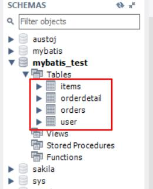

### 数据模型分析思路：

1、每张表记录的数据内容（分模块对每张表记录的内容进行熟悉，相当于学习系统需求的过程）

2、每张表重要的的字段设置（非空字段、外键字段）

3、数据库级别表与表之间的关系（外键关系）

4、表与表业务之间的关系（要建立在每个业务意义的基础上去分析）

### 数据模型分析模型

+ 用户表 user：记录购买商品的用户信息
+ 订单表 order：记录用户所创建的订单(购买商品的订单)
+ 订单明细表 orderdetail：（记录了订单的详细信息即购买商品的信息）
+ 商品表 items：记录了商品信息

**表与表业务之间的关系**：

在分析表与表之间的业务关系时需要建立在某个业务意义基础上去分析。

先分析数据级别之间有关系的表之间的业务关系：

1、**usre和orders**：

user ---> orders：一个用户可以创建多个订单，一对多

orders  ---> user：一个订单只由一个用户创建，一对一

2、 **orders和orderdetail**：

orders  --->  orderdetail：一个订单可以包括 多个订单明细，因为一个订单可以购买多个商品，每个商品的购买信息在orderdetail记录，一对多关系

 orderdetail  --->  orders：一个订单明细只能包括在一个订单中，一对一

3、 **orderdetail 和 itesm**：

orderdetail --->  itesms：一个订单明细只对应一个商品信息，一对一

 items  --->   orderdetail:一个商品可以包括在多个订单明细 ，一对多

 再分析数据库级别没有关系的表之间是否有业务关系：

4、 **orders 和 items**：

orders 和 items 之间可以通过 orderdetail 表建立 关系。

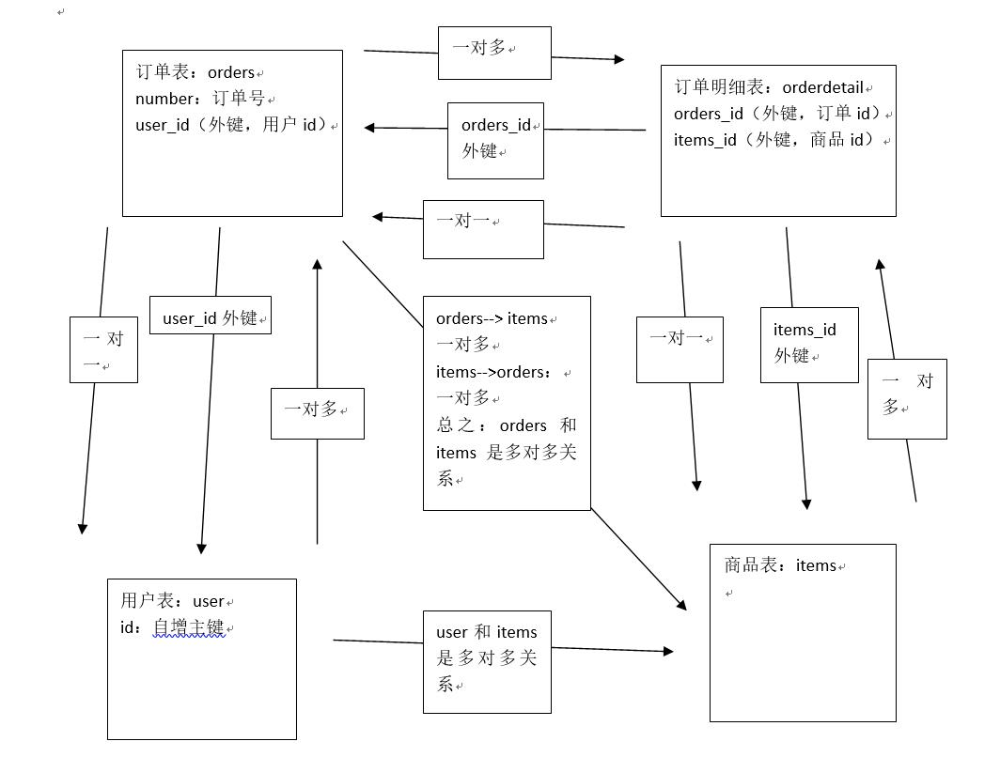


## 2、一对一查询

### 需求：

查询订单信息，关联查询创建订单的用户信息

### 使用 resultType

+ sql 语句

  确定查询的主表：订单表

  确定查询的关联表：用户表

  关联查询使用内链接？还是外链接？

  由于orders表中有一个外键（user_id），通过外键关联查询用户表只能查询出一条记录，可以使用内链接。

  ```sql
  SELECT orders.*, USER.username, USER.sex, USER.address FROM orders, USER WHERE orders.user_id = user.id
  ```

+ 创建 pojo

  `Orders.java`

  ```java
  public class Orders {
      private Integer id;
      private Integer userId;
      private String number;
      private Date createtime;
      private String note;
      //用户信息
      private User user;
      //订单明细
      private List<Orderdetail> orderdetails;
      //getter and setter
  }
  ```

  `OrderCustom.java`

  ```java
  //通过此类映射订单和用户查询的结果，让此类继承包括 字段较多的pojo类
  public class OrdersCustom extends Orders{
  	//添加用户属性
  	/*USER.username,
  	  USER.sex,
  	  USER.address */
  	private String username;
  	private String sex;
  	private String address;
  	//getter and setter	
  }
  ```

+ 映射文件 

  `OrdersMapperCustom.xml`

  ```xml
  <!--查询订单关联查询用户信息-->
      <select id="findOrdersUser" resultType="cn.zhisheng.mybatis.po.OrdersCustom">
          SELECT orders.*, USER.username, USER.sex, USER.address FROM orders, USER WHERE orders.user_id = user.id
      </select>
  ```

+ Mapper 文件

  `OrdersMapperCustom.java`

  ```java
  public interface OrdersMapperCustom
  {
      public OrdersCustom findOrdersUser() throws Exception;
  }
  ```

+ 测试代码（记得在 SqlConfig.xml中添加载 OrdersMapperCustom.xml 文件）

  ```java
   @Test
      public void testFindOrdersUser() throws Exception
      {
          SqlSession sqlSession = sqlSessionFactory.openSession();
          //创建OrdersMapperCustom对象,mybatis自动生成代理对象
          OrdersMapperCustom ordersMapperCustom = sqlSession.getMapper(OrdersMapperCustom.class);
          //调用OrdersMapperCustom的方法
           List<OrdersCustom> list = ordersMapperCustom.findOrdersUser();
          System.out.println(list);
          sqlSession.close();
      }
  ```

+ 测试结果

  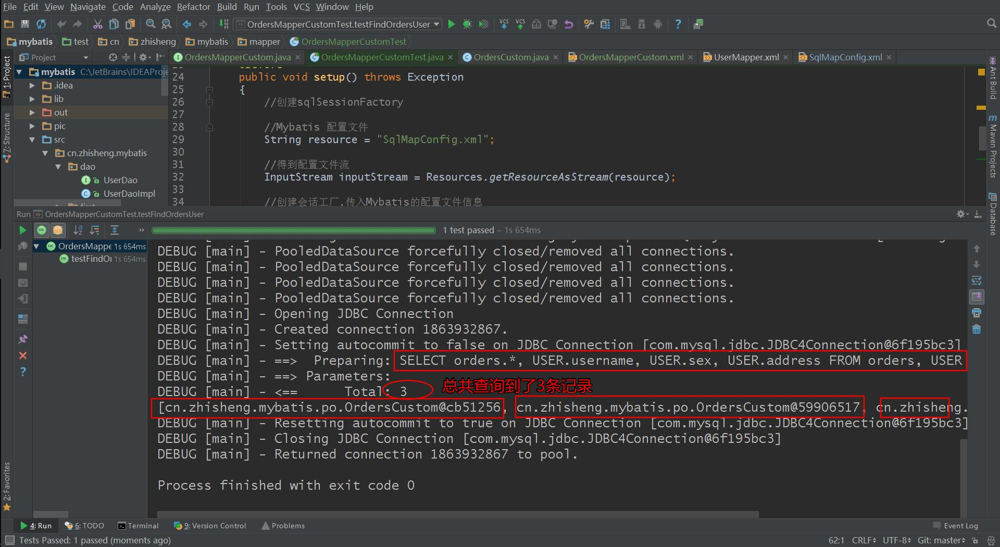

  ​

  ​


### 使用 resultMap

+ sql 语句（和上面的一致）

+ 使用 resultMap 映射思路

  使用 resultMap 将查询结果中的订单信息映射到 Orders 对象中，在 orders 类中添加 User 属性，将关联查询出来的用户信息映射到 orders 对象中的 user 属性中。 

  ```java
   //用户信息
   private User user;
  ```

+ 映射文件

  `OrdersMapperCustom.xml`

  先定义 resultMap

  ```xml
  <!--定义查询订单关联查询用户信息的resultMap
          将整个查询结果映射到cn.zhisheng.mybatis.po.Orders
      -->
      <resultMap id="OrdersUserResultMap" type="cn.zhisheng.mybatis.po.Orders">
          <!--配置映射的订单信息-->
          <!--id表示查询结果中的唯一标识  在这里是订单的唯一标识  如果是由多列组成的唯一标识，那么就需要配置多个id
          column：id 是订单信息中的唯一标识列
          property：id 是订单信息唯一标识列所映射到orders中的id属性
          最终resultMap对column和property做一个映射关系（对应关系）
          -->
          <id column="id" property="id"/>
          <result column="user_id" property="userId"/>
          <result column="number" property="number"/>
          <result column="createtime" property="createtime"/>
          <result column="note" property="note"/>

          <!--配置映射的关联用户信息
              association 用于映射关联查询单个对象的信息
              property  将要关联查询的用户信息映射到 orders中的属性中去
          -->
          <association property="user" javaType="cn.zhisheng.mybatis.po.User">
              <!--id 关联用户信息的唯一标识
                  column: 指定唯一标识用户的信息
                  property：映射到user的那个属性
              -->
              <id column="user_id" property="id"/>
              <result column="username" property="username"/>
              <result column="sex" property="sex"/>
              <result column="address" property="address"/>
              <result column="birthday" property="birthday"/>
          </association>
      </resultMap>
  ```

  ```xml
  <!--查询订单关联查询用户信息, 使用 resultMap-->
      <select id="findOrdersUserResultMap" resultMap="OrdersUserResultMap">
          SELECT orders.*, USER.username, USER.sex, USER.address FROM orders, USER WHERE orders.user_id = user.id
      </select>
  ```

+ Mapper 文件

  ```java
   public List<Orders> findOrdersUserResultMap() throws Exception;
  ```

+ 测试代码

  ```java
   @Test
      public void testFindOrdersUserResultMap() throws Exception
      {
          SqlSession sqlSession = sqlSessionFactory.openSession();
          //创建OrdersMapperCustom对象,mybatis自动生成代理对象
          OrdersMapperCustom ordersMapperCustom = sqlSession.getMapper(OrdersMapperCustom.class);
          //调用OrdersMapperCustom的方法
          List<Orders> list = ordersMapperCustom.findOrdersUserResultMap();
          System.out.println(list);
          sqlSession.close();
      }
  ```

+ 测试结果

  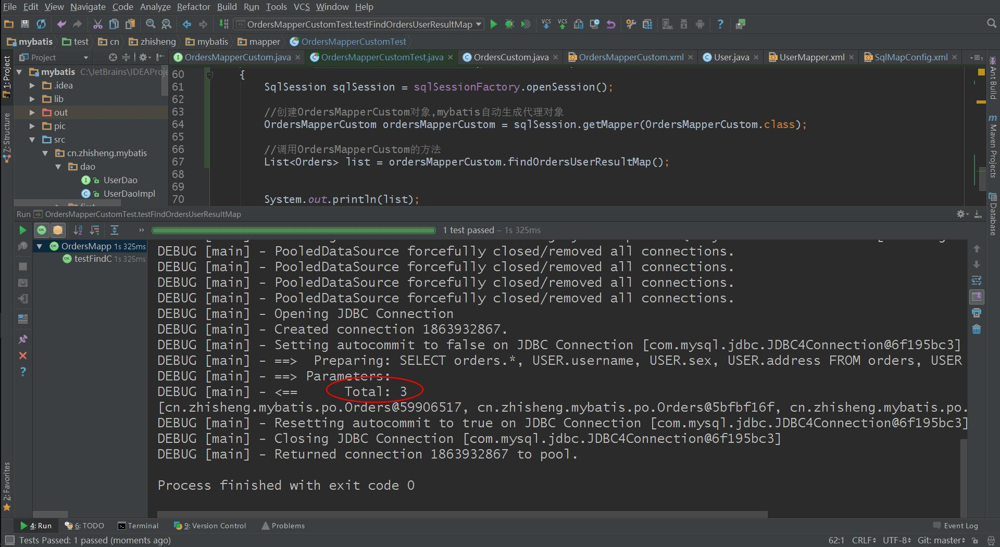


### 使用 resultType 和 resultMap 一对一查询小结

+ resultType：使用resultType实现较为简单，如果pojo中没有包括查询出来的列名，需要增加列名对应的属性，即可完成映射。如果没有查询结果的特殊要求建议使用resultType。
+ resultMap：需要单独定义resultMap，实现有点麻烦，如果对查询结果有特殊的要求，使用resultMap可以完成将关联查询映射pojo的属性中。resultMap可以实现延迟加载，resultType无法实现延迟加载。


## 一对多查询

**需求**：查询订单及订单明细信息

**SQL语句**：

确定主查询表：订单表

确定关联查询表：订单明细表

在一对一查询基础上添加订单明细表关联即可。

```sql
SELECT orders.*, USER.username, USER.sex, USER.address, orderdetail.id orderdetail_id, orderdetail.items_id, orderdetail.items_num, orderdetail.orders_id FROM orders, USER,
orderdetail WHERE orders.user_id = user.id AND orderdetail.orders_id=orders.id
```

分析：

使用 resultType 将上边的查询结果映射到 pojo 中，订单信息的就是重复。

要求：

> 对 orders 映射不能出现重复记录。

在 orders.java 类中添加 List<orderDetail> orderDetails 属性。

最终会将订单信息映射到 orders 中，订单所对应的订单明细映射到 orders 中的 orderDetails 属性中。

映射成的 orders 记录数为两条（orders信息不重复）

每个 orders 中的 orderDetails 属性存储了该订单所对应的订单明细。

**映射文件**：

首先定义 resultMap

```xml
<!--定义查询订单及订单明细信息的resultMap使用extends继承，不用在中配置订单信息和用户信息的映射-->
    <resultMap id="OrdersAndOrderDetailResultMap" type="cn.zhisheng.mybatis.po.Orders" extends="OrdersUserResultMap">
        <!-- 订单信息 -->
        <!-- 用户信息 -->
        <!-- 使用extends继承，不用在中配置订单信息和用户信息的映射 -->
        <!-- 订单明细信息
        一个订单关联查询出了多条明细，要使用collection进行映射
        collection：对关联查询到多条记录映射到集合对象中
        property：将关联查询到多条记录映射到cn.zhisheng.mybatis.po.Orders哪个属性
        ofType：指定映射到list集合属性中pojo的类型
         -->
        <collection property="orderdetails" ofType="cn.zhisheng.mybatis.po.Orderdetail">
        <!-- id：订单明细唯 一标识
   property:要将订单明细的唯 一标识 映射到cn.zhisheng.mybatis.po.Orderdetail的哪个属性-->
            <id column="orderdetail_id" property="id"/>
            <result column="items_id" property="itemsId"/>
            <result column="items_num" property="itemsNum"/>
            <result column="orders_id" property="ordersId"/>
        </collection>
    </resultMap>
```

```xml
 <!--查询订单及订单明细信息, 使用 resultMap-->
    <select id="findOrdersAndOrderDetailResultMap" resultMap="OrdersAndOrderDetailResultMap">
        SELECT orders.*, USER.username, USER.sex, USER.address, orderdetail.id orderdetail_id, orderdetail.items_id, orderdetail.items_num, orderdetail.orders_id
        FROM orders, USER,orderdetail WHERE orders.user_id = user.id AND orderdetail.orders_id=orders.id
    </select>
```

**Mapper 文件**

```java
public List<Orders> findOrdersAndOrderDetailResultMap() throws Exception;
```

**测试文件**

```java
@Test
    public void testFindOrdersAndOrderDetailResultMap() throws Exception
    {
        SqlSession sqlSession = sqlSessionFactory.openSession();
        //创建OrdersMapperCustom对象,mybatis自动生成代理对象
        OrdersMapperCustom ordersMapperCustom = sqlSession.getMapper(OrdersMapperCustom.class);
        //调用OrdersMapperCustom的方法
        List<Orders> list = ordersMapperCustom.findOrdersAndOrderDetailResultMap();
        System.out.println(list);
        sqlSession.close();
    }
```

**测试结果**

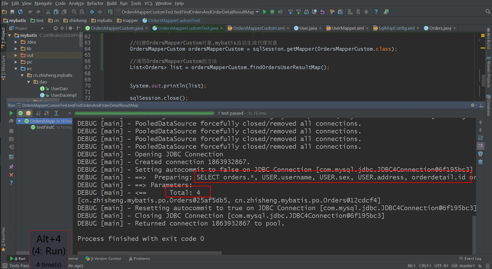

### 总结：

mybatis使用resultMap的collection对关联查询的多条记录映射到一个list集合属性中。 

使用resultType实现：将订单明细映射到orders中的orderdetails中，需要自己处理，使用双重循环遍历，去掉重复记录，将订单明细放在orderdetails中。


## 多对多查询

**需求**：查询用户及用户购买商品信息。

**SQL语句**：

查询主表是：用户表

关联表：由于用户和商品没有直接关联，通过订单和订单明细进行关联，所以关联表：

orders、orderdetail、items

```sql
SELECT   orders.*, USER.username, USER.sex, USER.address,  orderdetail.id orderdetail_id,
orderdetail.items_id, orderdetail.items_num, orderdetail.orders_id, items.name items_name,
items.detail items_detail, items.price items_price FROM orders, USER, orderdetail, items WHERE orders.user_id = user.id AND orderdetail.orders_id=orders.id AND orderdetail.items_id = items.id
```

**映射思路**：

将用户信息映射到 user 中。
在 user 类中添加订单列表属性List<Orders> orderslist，将用户创建的订单映射到orderslist
在Orders中添加订单明细列表属性List<OrderDetail>orderdetials，将订单的明细映射到orderdetials
在OrderDetail中添加Items属性，将订单明细所对应的商品映射到Items

### 定义 resultMap：

```xml
<!--定义查询用户及用户购买商品信息的 resultMap-->
    <resultMap id="UserAndItemsResultMap" type="cn.zhisheng.mybatis.po.User">
        <!--用户信息-->
        <id column="user_id" property="id"/>
        <result column="username" property="username"/>
        <result column="sex" property="sex"/>
        <result column="birthday" property="birthday"/>
        <result column="address" property="address"/>

        <!--订单信息
		    一个用户对应多个订单，使用collection映射
		-->
        <collection property="ordersList" ofType="cn.zhisheng.mybatis.po.Orders">
            <id column="id" property="id"/>
            <result column="user_id" property="userId"/>
            <result column="number" property="number"/>
            <result column="createtime" property="createtime"/>
            <result column="note" property="note"/>

            <!-- 订单明细
		        一个订单包括 多个明细
		    -->
            <collection property="orderdetails" ofType="cn.zhisheng.mybatis.po.Orderdetail">

                <id column="orderdetail_id" property="id"/>
                <result column="orders_id" property="ordersId"/>
                <result column="items_id" property="itemsId"/>
                <result column="items_num" property="itemsNum"/>

                <!-- 商品信息
                     一个订单明细对应一个商品
                -->
                <association property="items" javaType="cn.zhisheng.mybatis.po.Items">
                    <id column="items_id" property="id"/>
                    <result column="items_name" property="name"/>
                    <result column="items_price" property="price"/>
                    <result column="items_pic" property="pic"/>
                    <result column="items_createtime" property="createtime"/>
                    <result column="items_detail" property="detail"/>
                 </association>
            </collection>
        </collection>
    </resultMap>
```

### 映射文件

```xml
<!--查询用户及用户购买商品信息, 使用 resultMap-->
    <select id="findUserAndItemsResultMap" resultMap="UserAndItemsResultMap">
        SELECT orders.*, USER.username, USER.sex, USER.address, orderdetail.id orderdetail_id, orderdetail.items_id, orderdetail.items_num, orderdetail.orders_id
        FROM orders, USER,orderdetail WHERE orders.user_id = user.id AND orderdetail.orders_id=orders.id
    </select>
```

### Mapper 文件

```java
public List<User> findUserAndItemsResultMap() throws  Exception;
```

### 测试文件

```java
@Test
    public void testFindUserAndItemsResultMap() throws Exception
    {
        SqlSession sqlSession = sqlSessionFactory.openSession();
        //创建OrdersMapperCustom对象,mybatis自动生成代理对象
        OrdersMapperCustom ordersMapperCustom = sqlSession.getMapper(OrdersMapperCustom.class);
        //调用OrdersMapperCustom的方法
        List<User> list = ordersMapperCustom.findUserAndItemsResultMap();
        System.out.println(list);
        sqlSession.close();
    }
```

### 测试：

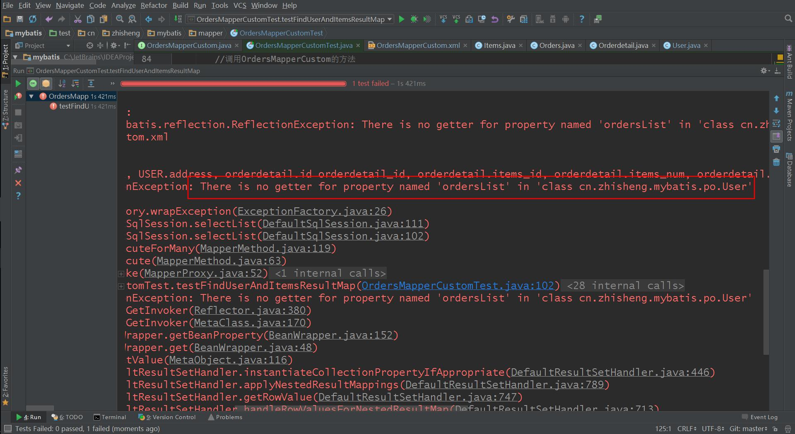

我去，竟然报错了，但是不要怕，通过查看报错信息可以知道我忘记在 User.java 中加入 orderlist 属性了，接下来我加上去，并加上 getter 和 setter 方法。

```java
//用户创建的订单列表
    private List<Orders> ordersList;
    public List<Orders> getOrdersList() {
        return ordersList;
    }
    public void setOrdersList(List<Orders> ordersList) {
        this.ordersList = ordersList;
    }
```

 再次测试就能成功了。

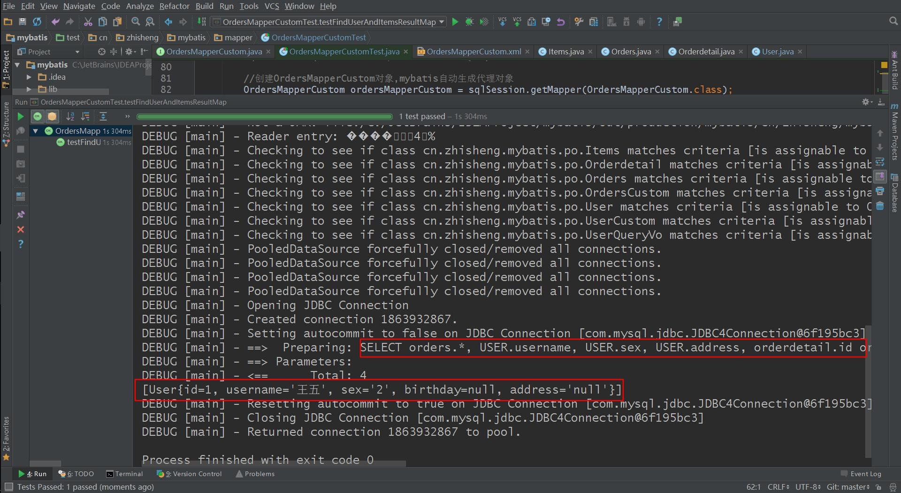

### 多对多查询总结

将查询用户购买的商品信息明细清单，（用户名、用户地址、购买商品名称、购买商品时间、购买商品数量）

 针对上边的需求就使用resultType将查询到的记录映射到一个扩展的pojo中，很简单实现明细清单的功能。

 一对多是多对多的特例，如下需求：

> 查询用户购买的商品信息，用户和商品的关系是多对多关系。

需求1：

> 查询字段：用户账号、用户名称、用户性别、商品名称、商品价格(最常见)
>
> 企业开发中常见明细列表，用户购买商品明细列表，
>
> 使用resultType将上边查询列映射到pojo输出。

 需求2：

> 查询字段：用户账号、用户名称、购买商品数量、商品明细（鼠标移上显示明细）
>
> 使用resultMap将用户购买的商品明细列表映射到user对象中。

 总结：

> 使用resultMap是针对那些对查询结果映射有特殊要求的功能，，比如特殊要求映射成list中包括多个list。


## ResultMap 总结

### resultType：

作用：

> 将查询结果按照sql列名pojo属性名一致性映射到pojo中。

场合：
> 常见一些明细记录的展示，比如用户购买商品明细，将关联查询信息全部展示在页面时，此时可直接使用resultType将每一条记录映射到pojo中，在前端页面遍历list（list中是pojo）即可。

### resultMap：

> 使用association和collection完成一对一和一对多高级映射（对结果有特殊的映射要求）。

### association：

作用：

> 将关联查询信息映射到一个pojo对象中。

场合：
> 为了方便查询关联信息可以使用association将关联订单信息映射为用户对象的pojo属性中，比如：查询订单及关联用户信息。
> 使用resultType无法将查询结果映射到pojo对象的pojo属性中，根据对结果集查询遍历的需要选择使用resultType还是resultMap。

### collection：

作用：

> 将关联查询信息映射到一个list集合中。

场合：
> 为了方便查询遍历关联信息可以使用collection将关联信息映射到list集合中，比如：查询用户权限范围模块及模块下的菜单，可使用collection将模块映射到模块list中，将菜单列表映射到模块对象的菜单list属性中，这样的作的目的也是方便对查询结果集进行遍历查询。如果使用resultType无法将查询结果映射到list集合中。


## 延迟加载

### 什么是延迟加载？

resultMap可以实现高级映射（使用association、collection实现一对一及一对多映射），association、collection具备延迟加载功能。
需求：
如果查询订单并且关联查询用户信息。如果先查询订单信息即可满足要求，当我们需要查询用户信息时再查询用户信息。把对用户信息的按需去查询就是延迟加载。

延迟加载：先从单表查询、需要时再从关联表去关联查询，大大提高 数据库性能，因为查询单表要比关联查询多张表速度要快。

### 打开延迟加载开关

在mybatis核心配置文件中配置：

lazyLoadingEnabled、aggressiveLazyLoading

|          设置项          |                    描述                    |      允许值      |  默认值  |
| :-------------------: | :--------------------------------------: | :-----------: | :---: |
|  lazyLoadingEnabled   |  全局性设置懒加载。如果设为‘false’，则所有相关联的都会被初始化加载。   | true \| false | false |
| aggressiveLazyLoading | 当设置为‘true’的时候，懒加载的对象可能被任何懒属性全部加载。否则，每个属性都按需加载。 | true \| false | true  |

```xml
<settings>
		<setting name="lazyLoadingEnabled" value="true"/>
		<setting name="aggressiveLazyLoading" value="false"/>
</settings>
```


### 使用 association 实现延迟加载

需求：查询订单并且关联查询用户信息

### Mapper.xml

需要定义两个 mapper 的方法对应的 statement。

1、只查询订单信息

SQL 语句： `select * from orders`

在查询订单的 statement 中使用 association 去延迟加载（执行）下边的 statement (关联查询用户信息)

```xml
<!--查询订单并且关联查询用户信息，关联用户信息需要通过 association 延迟加载-->
    <select id="findOrdersUserLazyLoading" resultMap="OrdersUserLazyLoadingResultMap">
        select * from orders
    </select>
```

2、关联查询用户信息

通过上面查询订单信息中的 user_id 来关联查询用户信息。使用 UserMapper.xml 中的 findUserById

SQL语句：`select * from user where id = user_id`

```xml
<select id="findUserById" parameterType="int" resultType="user">
        select * from user where id = #{value}
    </select>
```

上边先去执行 findOrdersUserLazyLoading，当需要去查询用户的时候再去执行 findUserById ，通过 resultMap的定义将延迟加载执行配置起来。也就是通过 resultMap 去加载 UserMapper.xml 文件中的 select = findUserById

### 延迟加载的 resultMap

```xml
<!--定义 关联用户信息（通过 association 延迟加载）的resultMap-->
    <resultMap id="OrdersUserLazyLoadingResultMap" type="cn.zhisheng.mybatis.po.Orders">
        <!--对订单信息映射-->
        <id column="id" property="id"/>
        <result column="user_id" property="userId"/>
        <result column="number" property="number"/>
        <result column="createtime" property="createtime"/>
        <result column="note" property="note"/>
        <!-- 实现对用户信息进行延迟加载
		select：指定延迟加载需要执行的statement的id（是根据user_id查询用户信息的statement）
		要使用userMapper.xml中findUserById完成根据用户id(user_id)用户信息的查询，如果findUserById不在本mapper中需要前边加namespace
		column：订单信息中关联用户信息查询的列，是user_id
		关联查询的sql理解为：
			SELECT orders.*,
	        (SELECT username FROM USER WHERE orders.user_id = user.id)username,
	        (SELECT sex FROM USER WHERE orders.user_id = user.id)sex
	        FROM orders-->
        <association property="user" javaType="cn.zhisheng.mybatis.po.User" select="cn.zhisheng.mybatis.mapper.UserMapper.findUserById" column="user_id">
        </association>
    </resultMap>
```

### OrderMapperCustom.java

```java
public List<Orders> findOrdersUserLazyLoading() throws Exception;
```

### 测试代码：

```java
@Test
    public void testFindOrdersUserLazyLoading() throws Exception
    {
        SqlSession sqlSession = sqlSessionFactory.openSession();
        //创建OrdersMapperCustom对象,mybatis自动生成代理对象
        OrdersMapperCustom ordersMapperCustom = sqlSession.getMapper(OrdersMapperCustom.class);
        //查询订单信息
        List<Orders> list = ordersMapperCustom.findOrdersUserLazyLoading();
        //遍历所查询的的订单信息
        for (Orders orders : list)
        {
            //查询用户信息
            User user = orders.getUser();
            System.out.println(user);
        }
        sqlSession.close();
    }
```

### 测试结果：

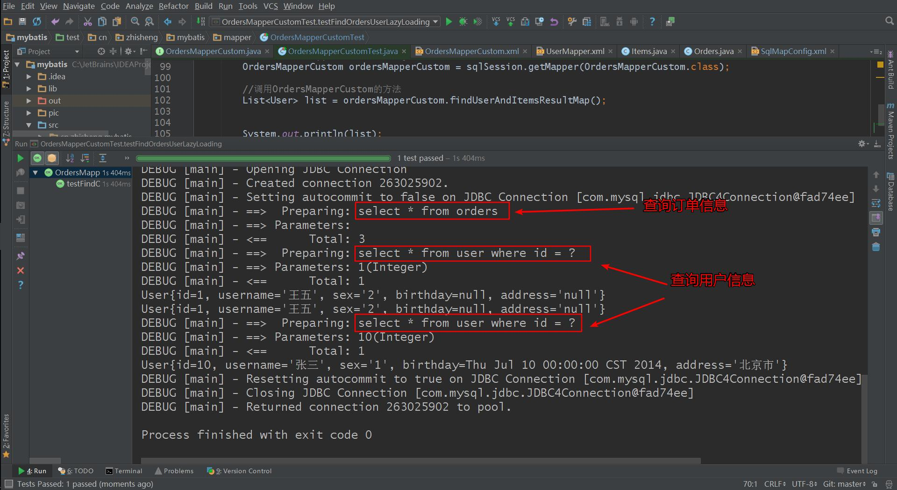

整个延迟加载的思路：    

1、执行上边mapper方法（findOrdersUserLazyLoading），内部去调用cn.zhisheng.mybatis.mapper.OrdersMapperCustom 中的 findOrdersUserLazyLoading 只查询 orders 信息（单表）。

2、在程序中去遍历上一步骤查询出的 List<Orders>，当我们调用 Orders 中的 getUser 方法时，开始进行延迟加载。

3、延迟加载，去调用 UserMapper.xml 中 findUserbyId 这个方法获取用户信息。

### 思考：

不使用 mybatis 提供的 association 及 collection 中的延迟加载功能，如何实现延迟加载？？

实现方法如下：

定义两个mapper方法：

1、查询订单列表

2、根据用户id查询用户信息

实现思路：

先去查询第一个mapper方法，获取订单信息列表

在程序中（service），按需去调用第二个mapper方法去查询用户信息。

总之：

使用延迟加载方法，先去查询 简单的 sql（最好单表，也可以关联查询），再去按需要加载关联查询的其它信息。

### 一对多延迟加载

上面的那个案例是一对一延迟加载，那么如果我们想一对多进行延迟加载呢，其实也是很简单的。

一对多延迟加载的方法同一对一延迟加载，在collection标签中配置select内容。

### 延迟加载总结：

作用：
> 当需要查询关联信息时再去数据库查询，默认不去关联查询，提高数据库性能。
> 只有使用resultMap支持延迟加载设置。

场合：

> 当只有部分记录需要关联查询其它信息时，此时可按需延迟加载，需要关联查询时再向数据库发出sql，以提高数据库性能。
>
> 当全部需要关联查询信息时，此时不用延迟加载，直接将关联查询信息全部返回即可，可使用resultType或resultMap完成映射。


## 查询缓存

### 什么是查询缓存？

mybatis提供查询缓存，用于减轻数据压力，提高数据库性能。

mybaits提供一级缓存，和二级缓存。

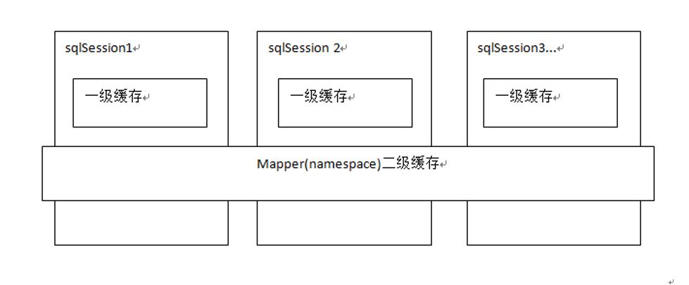

 

+ 一级缓存是SqlSession级别的缓存。在操作数据库时需要构造 sqlSession对象，在对象中有一个数据结构（HashMap）用于存储缓存数据。不同的sqlSession之间的缓存数据区域（HashMap）是互相不影响的。
+ 二级缓存是mapper级别的缓存，多个SqlSession去操作同一个Mapper的sql语句，多个SqlSession可以共用二级缓存，二级缓存是跨SqlSession的。

 为什么要用缓存？

如果缓存中有数据就不用从数据库中获取，大大提高系统性能。

### 一级缓存

**工作原理**：

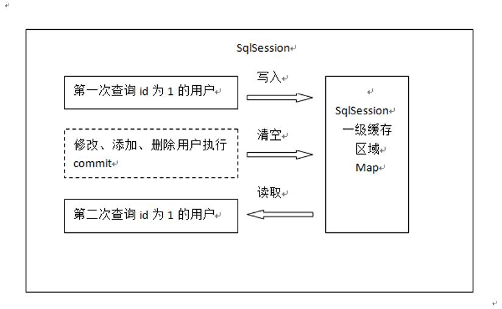

 

第一次发起查询用户id为1的用户信息，先去找缓存中是否有id为1的用户信息，如果没有，从数据库查询用户信息。

得到用户信息，将用户信息存储到一级缓存中。

如果sqlSession去执行commit操作（执行插入、更新、删除），清空SqlSession中的一级缓存，这样做的目的为了让缓存中存储的是最新的信息，避免脏读。

第二次发起查询用户id为1的用户信息，先去找缓存中是否有id为1的用户信息，缓存中有，直接从缓存中获取用户信息。

**一级缓存测试**

Mybatis 默认支持一级缓存，不需要在配置文件中配置。

所以我们直接按照上面的步骤进行测试：

```java
//一级缓存测试
    @Test
    public void  testCache1() throws Exception {
        SqlSession sqlSession = sqlSessionFactory.openSession();
        //创建UserMapper对象,mybatis自动生成代理对象
        UserMapper userMapper = sqlSession.getMapper(UserMapper.class);
        //查询使用的是同一个session
        //第一次发起请求，查询Id 为1的用户信息
        User user1 = userMapper.findUserById(1);
        System.out.println(user1);
        //第二次发起请求，查询Id 为1的用户信息
        User user2 = userMapper.findUserById(1);
        System.out.println(user2);
        sqlSession.close();
    }
```

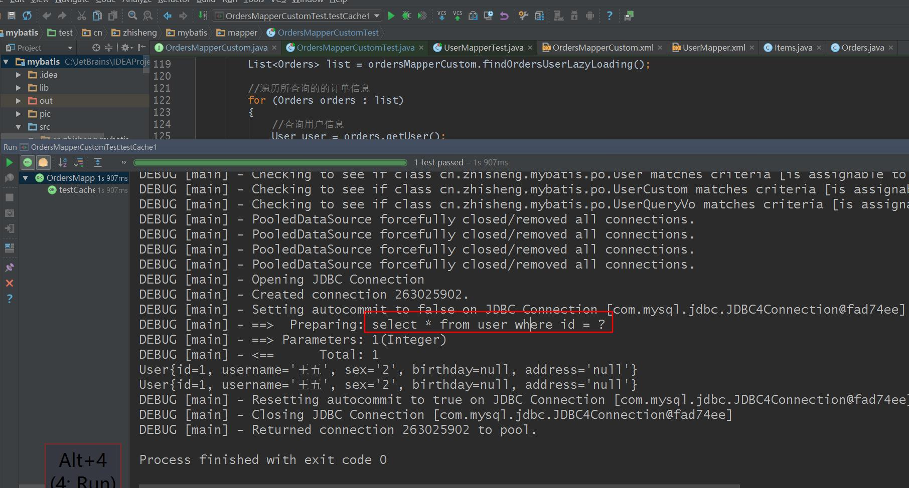

通过结果可以看出第二次没有发出sql查询请求，

所以我们需要在中间执行 commit 操作

```java
//如果sqlSession去执行commit操作（执行插入、更新、删除），
// 清空SqlSession中的一级缓存，这样做的目的为了让缓存中存储的是最新的信息，避免脏读。
//更新user1的信息，
user1.setUsername("李飞");
//user1.setSex("男");
//user1.setAddress("北京");
userMapper.updateUserById(user1);
//提交事务,才会去清空缓存
sqlSession.commit();
```

测试

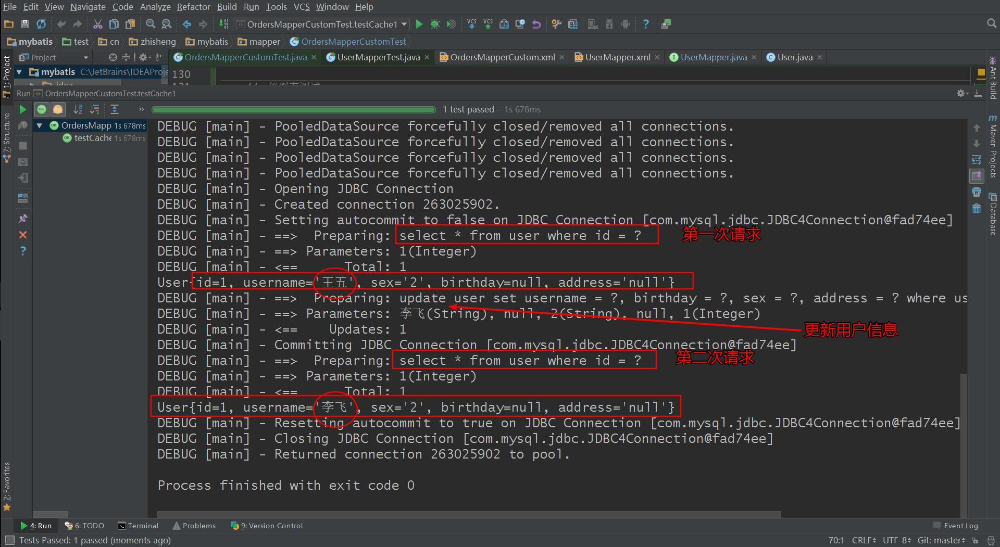

**一级缓存应用**

正式开发，是将 mybatis 和 spring 进行整合开发，事务控制在 service 中。

一个 service 方法中包括很多 mapper 方法调用。

service{

         //开始执行时，开启事务，创建SqlSession对象

         //第一次调用mapper的方法findUserById(1)

         //第二次调用mapper的方法findUserById(1)，从一级缓存中取数据

         //方法结束，sqlSession关闭

}

如果是执行两次service调用查询相同的用户信息，不走一级缓存，因为session方法结束，sqlSession就关闭，一级缓存就清空。


### 二级缓存

原理

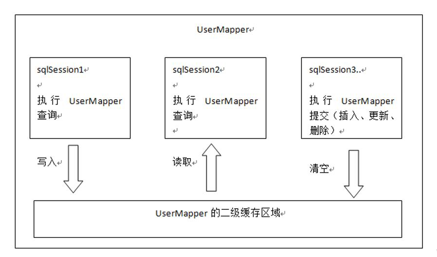

首先开启mybatis的二级缓存。

 sqlSession1去查询用户id为1的用户信息，查询到用户信息会将查询数据存储到二级缓存中。 

如果SqlSession3去执行相同 mapper下sql，执行commit提交，清空该 mapper下的二级缓存区域的数据。 

sqlSession2去查询用户id为1的用户信息，去缓存中找是否存在数据，如果存在直接从缓存中取出数据。 

二级缓存与一级缓存区别，二级缓存的范围更大，多个sqlSession可以共享一个UserMapper的二级缓存区域。

UserMapper有一个二级缓存区域（按namespace分） ，其它mapper也有自己的二级缓存区域（按namespace分）。

每一个namespace的mapper都有一个二缓存区域，两个mapper的namespace如果相同，这两个mapper执行sql查询到数据将存在相同的二级缓存区域中。

**开启二级缓存**：

mybaits的二级缓存是mapper范围级别，除了在SqlMapConfig.xml设置二级缓存的总开关，还要在具体的mapper.xml中开启二级缓存

在 SqlMapConfig.xml 开启二级开关

```java
<!-- 开启二级缓存 -->
<setting name="cacheEnabled" value="true"/>
```

然后在你的 Mapper 映射文件中添加一行：  <cache/> ，表示此 mapper 开启二级缓存。

**调用 pojo 类实现序列化接口**：

二级缓存需要查询结果映射的pojo对象实现java.io.Serializable接口实现序列化和反序列化操作（因为二级缓存数据存储介质多种多样，在内存不一样），注意如果存在父类、成员pojo都需要实现序列化接口。

```java
public class Orders implements Serializable
public class User implements Serializable
```

**测试**

```java
//二级缓存测试
    @Test
    public void testCache2() throws Exception
    {
        SqlSession sqlSession1 = sqlSessionFactory.openSession();
        SqlSession sqlSession2 = sqlSessionFactory.openSession();
        SqlSession sqlSession3 = sqlSessionFactory.openSession();


        //创建UserMapper对象,mybatis自动生成代理对象
        UserMapper userMapper1 = sqlSession1.getMapper(UserMapper.class);
        //sqlSession1 执行查询 写入缓存(第一次查询请求)
        User user1 = userMapper1.findUserById(1);
        System.out.println(user1);
        sqlSession1.close();


        //sqlSession3  执行提交  清空缓存
        UserMapper userMapper3 = sqlSession3.getMapper(UserMapper.class);
        User user3 = userMapper3.findUserById(1);
        user3.setSex("女");
        user3.setAddress("山东济南");
        user3.setUsername("崔建");
        userMapper3.updateUserById(user3);
        //提交事务，清空缓存
        sqlSession3.commit();
        sqlSession3.close();
        
        //sqlSession2 执行查询(第二次查询请求)
        UserMapper userMapper2 = sqlSession2.getMapper(UserMapper.class);
        User user2 = userMapper2.findUserById(1);
        System.out.println(user2);
        sqlSession2.close();
   }
```

**结果**：

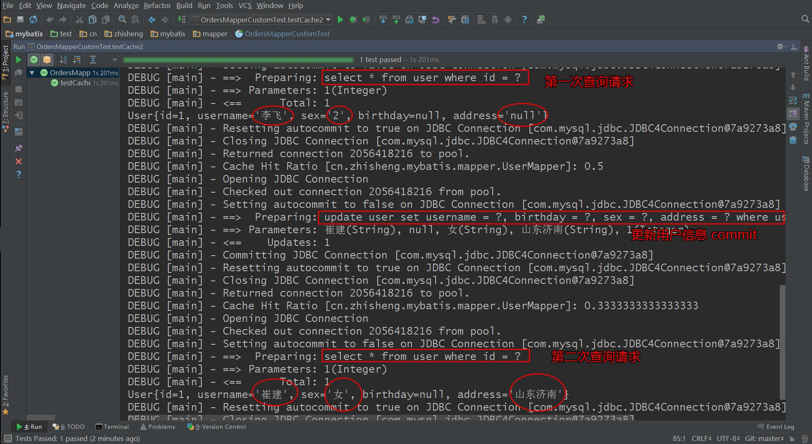

**useCache 配置**

 在 statement 中设置 useCache=false 可以禁用当前 select 语句的二级缓存，即每次查询都会发出sql去查询，默认情况是true，即该sql使用二级缓存。

```xml
<select id="findUserById" parameterType="int" resultType="user" useCache="false">
```

总结：针对每次查询都需要最新的数据sql，要设置成useCache=false，禁用二级缓存。 

**刷新缓存（清空缓存）**

在mapper的同一个namespace中，如果有其它insert、update、delete操作数据后需要刷新缓存，如果不执行刷新缓存会出现脏读。

 设置statement配置中的flushCache="true" 属性，默认情况下为true即刷新缓存，如果改成false则不会刷新。使用缓存时如果手动修改数据库表中的查询数据会出现脏读。

如下：

```xml
<insert id="insetrUser" parameterType="cn.zhisheng.mybatis.po.User" flushCache="true">
```

一般下执行完commit操作都需要刷新缓存，flushCache=true表示刷新缓存，这样可以避免数据库脏读。


### Mybatis Cache参数

flushInterval（刷新间隔）可以被设置为任意的正整数，而且它们代表一个合理的毫秒形式的时间段。默认情况是不设置，也就是没有刷新间隔，缓存仅仅调用语句时刷新。

size（引用数目）可以被设置为任意正整数，要记住你缓存的对象数目和你运行环境的可用内存资源数目。默认值是1024。

readOnly（只读）属性可以被设置为true或false。只读的缓存会给所有调用者返回缓存对象的相同实例。因此这些对象不能被修改。这提供了很重要的性能优势。可读写的缓存会返回缓存对象的拷贝（通过序列化）。这会慢一些，但是安全，因此默认是false。

如下例子：

```xml
<cache  eviction="FIFO" flushInterval="60000"  size="512" readOnly="true"/>
```

这个更高级的配置创建了一个 FIFO 缓存,并每隔 60 秒刷新,存数结果对象或列表的 512 个引用,而且返回的对象被认为是只读的,因此在不同线程中的调用者之间修改它们会导致冲突。可用的收回策略有, 默认的是 LRU:

1.     LRU – 最近最少使用的:移除最长时间不被使用的对象。

2.     FIFO – 先进先出:按对象进入缓存的顺序来移除它们。

3.     SOFT – 软引用:移除基于垃圾回收器状态和软引用规则的对象。

4.     WEAK – 弱引用:更积极地移除基于垃圾收集器状态和弱引用规则的对象。


### Mybatis 整合 ehcache

ehcache 是一个分布式缓存框架。

**分布缓存**

我们系统为了提高系统并发，性能、一般对系统进行分布式部署（集群部署方式）

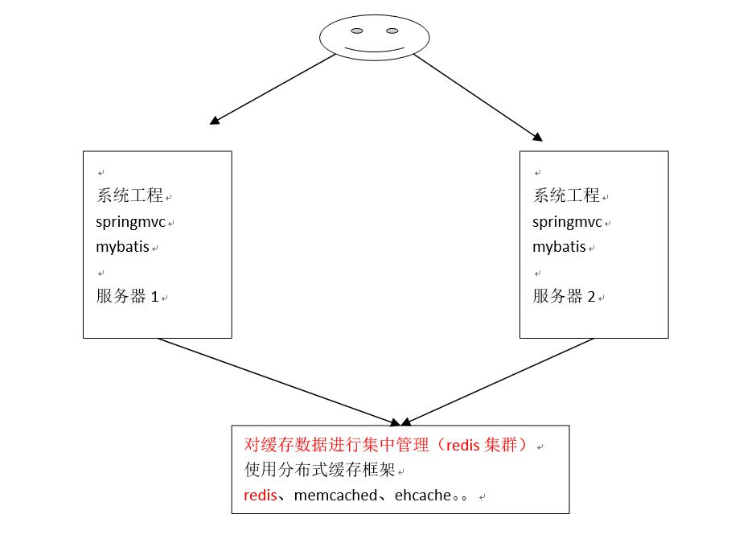

不使用分布缓存，缓存的数据在各各服务单独存储，不方便系统 开发。所以要使用分布式缓存对缓存数据进行集中管理。


mybatis无法实现分布式缓存，需要和其它分布式缓存框架进行整合。

**整合方法**

mybatis 提供了一个二级缓存 cache 接口（`org.apache.ibatis.cache` 下的 `Cache`），如果要实现自己的缓存逻辑，实现cache接口开发即可。

```java
import java.util.concurrent.locks.ReadWriteLock;
public interface Cache {
    String getId();
    void putObject(Object var1, Object var2);
    Object getObject(Object var1);
    Object removeObject(Object var1);
    void clear();
    int getSize();
    ReadWriteLock getReadWriteLock();
}
```

mybatis和ehcache整合，mybatis 和 ehcache 整合包中提供了一个 cache 接口的实现类(`org.apache.ibatis.cache.impl` 下的 `PerpetualCache`)。

```java
package org.apache.ibatis.cache.impl;
import java.util.HashMap;
import java.util.Map;
import java.util.concurrent.locks.ReadWriteLock;
import org.apache.ibatis.cache.Cache;
import org.apache.ibatis.cache.CacheException;
public class PerpetualCache implements Cache {
    private String id;
    private Map<Object, Object> cache = new HashMap();
    public PerpetualCache(String id) {
        this.id = id;
    }
    public String getId() {
        return this.id;
    }
    public int getSize() {
        return this.cache.size();
    }
    public void putObject(Object key, Object value) {
        this.cache.put(key, value);
    }
    public Object getObject(Object key) {
        return this.cache.get(key);
    }
    public Object removeObject(Object key) {
        return this.cache.remove(key);
    }
    public void clear() {
        this.cache.clear();
    }
    public ReadWriteLock getReadWriteLock() {
        return null;
    }
    public boolean equals(Object o) {
        if(this.getId() == null) {
            throw new CacheException("Cache instances require an ID.");
        } else if(this == o) {
            return true;
        } else if(!(o instanceof Cache)) {
            return false;
        } else {
            Cache otherCache = (Cache)o;
            return this.getId().equals(otherCache.getId());
        }
    }
    public int hashCode() {
        if(this.getId() == null) {
            throw new CacheException("Cache instances require an ID.");
        } else {
            return this.getId().hashCode();
        }
    }
}
```

通过实现 Cache 接口可以实现 mybatis 缓存数据通过其它缓存数据库整合，mybatis 的特长是sql操作，缓存数据的管理不是 mybatis 的特长，为了提高缓存的性能将 mybatis 和第三方的缓存数据库整合，比如 ehcache、memcache、redis等。

+ 引入依赖包

  `ehcache-core-2.6.5.jar` 和 `mybatis-ehcache-1.0.2.jar`

+ 引入缓存配置文件

  classpath下添加：ehcache.xml

  内容如下：

  ```xml
  <ehcache xmlns:xsi="http://www.w3.org/2001/XMLSchema-instance"
  	xsi:noNamespaceSchemaLocation="http://ehcache.org/ehcache.xsd">
  	<diskStore path="C:\JetBrains\IDEAProject\ehcache" />
  	<defaultCache 
  		maxElementsInMemory="1000" 
  		maxElementsOnDisk="10000000"
  		eternal="false" 
  		overflowToDisk="false" 
  		timeToIdleSeconds="120"
  		timeToLiveSeconds="120" 
  		diskExpiryThreadIntervalSeconds="120"
  		memoryStoreEvictionPolicy="LRU">
  	</defaultCache>
  </ehcache>
  ```

  属性说明：

  + diskStore：指定数据在磁盘中的存储位置。
  + defaultCache：当借助 CacheManager.add("demoCache") 创建Cache时，EhCache 便会采用<defalutCache/>指定的的管理策略

  以下属性是必须的：

  + maxElementsInMemory - 在内存中缓存的element的最大数目 
  + maxElementsOnDisk - 在磁盘上缓存的element的最大数目，若是0表示无穷大
  + eternal - 设定缓存的elements是否永远不过期。如果为true，则缓存的数据始终有效，如果为false那么还要根据timeToIdleSeconds，timeToLiveSeconds判断
  + overflowToDisk- 设定当内存缓存溢出的时候是否将过期的element缓存到磁盘上

  以下属性是可选的：

  + timeToIdleSeconds - 当缓存在EhCache中的数据前后两次访问的时间超过timeToIdleSeconds的属性取值时，这些数据便会删除，默认值是0,也就是可闲置时间无穷大
  + timeToLiveSeconds - 缓存element的有效生命期，默认是0.,也就是element存活时间无穷大

         diskSpoolBufferSizeMB 这个参数设置DiskStore(磁盘缓存)的缓存区大小.默认是30MB.每个Cache都应该有自己的一个缓冲区.

  + diskPersistent- 在VM重启的时候是否启用磁盘保存EhCache中的数据，默认是false。
  + diskExpiryThreadIntervalSeconds - 磁盘缓存的清理线程运行间隔，默认是120秒。每个120s，相应的线程会进行一次EhCache中数据的清理工作
  + memoryStoreEvictionPolicy - 当内存缓存达到最大，有新的element加入的时候， 移除缓存中element的策略。默认是LRU（最近最少使用），可选的有LFU（最不常使用）和FIFO（先进先出）

+ 开启ehcache缓存

  EhcacheCache 是ehcache对Cache接口的实现；修改mapper.xml文件，在cache中指定EhcacheCache。

  根据需求调整缓存参数：

  ```xml
  <cache type="org.mybatis.caches.ehcache.EhcacheCache" > 
          <property name="timeToIdleSeconds" value="3600"/>
          <property name="timeToLiveSeconds" value="3600"/>
          <!-- 同ehcache参数maxElementsInMemory -->
  		<property name="maxEntriesLocalHeap" value="1000"/>
  		<!-- 同ehcache参数maxElementsOnDisk -->
          <property name="maxEntriesLocalDisk" value="10000000"/>
          <property name="memoryStoreEvictionPolicy" value="LRU"/>
      </cache>
  ```

**测试** ：(这命中率就代表成功将ehcache 与 mybatis 整合了)

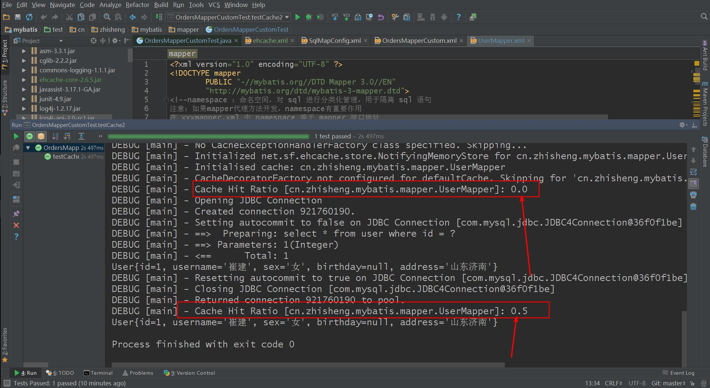

### 应用场景

对于访问多的查询请求且用户对查询结果实时性要求不高，此时可采用 mybatis 二级缓存技术降低数据库访问量，提高访问速度，业务场景比如：耗时较高的统计分析sql、电话账单查询sql等。

实现方法如下：通过设置刷新间隔时间，由 mybatis 每隔一段时间自动清空缓存，根据数据变化频率设置缓存刷新间隔 flushInterval，比如设置为30分钟、60分钟、24小时等，根据需求而定。

### 局限性

mybatis 二级缓存对细粒度的数据级别的缓存实现不好，比如如下需求：对商品信息进行缓存，由于商品信息查询访问量大，但是要求用户每次都能查询最新的商品信息，此时如果使用 mybatis 的二级缓存就无法实现当一个商品变化时只刷新该商品的缓存信息而不刷新其它商品的信息，因为 mybaits 的二级缓存区域以 mapper 为单位划分，当一个商品信息变化会将所有商品信息的缓存数据全部清空。解决此类问题需要在业务层根据需求对数据有针对性缓存。


